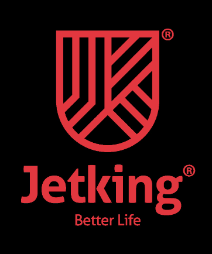

# Jetking Project   &nbsp; 

> This is a sample README file for the Jetking project, which consists of an `index.html` file and a `style.css` file.

## Project Overview

The Jetking project is a web-based application developed using HTML and CSS. It aims to showcase the services and courses offered by Jetking, a leading computer hardware and networking training institute.

## Project Structure

The project consists of the following files:

- `index.html`: The main HTML file that contains the structure and content of the web page.
- `style.css`: The CSS file that defines the styles and layout of the web page.

## Usage

To run the Jetking project, follow these steps:

1. Download the project files from the repository.
2. Open the `index.html` file in a web browser.

## Customization

To customize the project according to your needs, you can make the following modifications:

- Update the content in the `index.html` file to reflect your desired information.
- Modify the styles in the `style.css` file to change the appearance and layout of the web page.

## Dependencies

The Jetking project does not have any external dependencies. It uses standard HTML and CSS, which are supported by modern web browsers.

## Contributing

Contributions to the Jetking project are welcome. If you find any issues or have suggestions for improvements, please submit a pull request or open an issue in the project repository.

## License

The Jetking project is released under the [MIT License](LICENSE).

